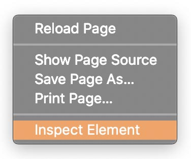
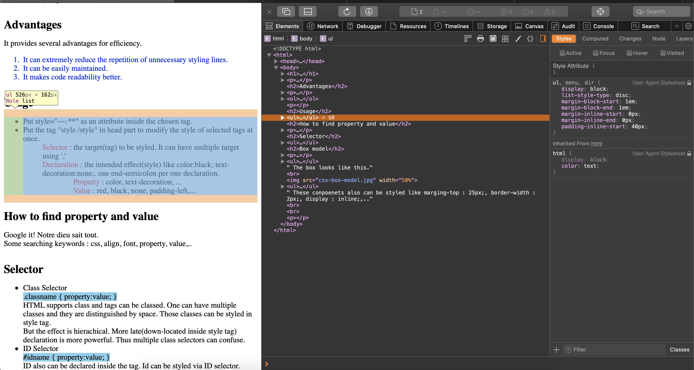

Mar 6, 2020     WEB2 - CSS 8-9  
[CSS 내용 정리](https://eunzihong.github.io/Webtest/css.html)

----

어제 오늘 몸이 좀 안 좋아서 진도를 많이 못 나갔다.  
시국이 시국인지라 몸 관리가 중요하니 어제는 푹 쉬고 오늘은 딱 2개만 들었다.  
그리고 오늘은 내 생일이기도 하니까,, 흠흠,,,  
 

### 8-9 `css`의 box model  
`css`의 디자인적 효과를 극대화시켜준 요소 중 하나는 바로 box model이다.  
`html`의 글이나 이미지등의 컨텐츠들은 화면에 표시될 때 각자의 영역/공간을 점유하게 된다.  
이 때 이 공간을 이 컨텐츠의 box라고 보는 것이다. 이 상자는 페이지에서 해당 줄 전체를 차지할 수도 있고, 다른 컨텐츠들과 어우러져 한 줄 중간에 위치할 수도 있다. `html`의 각 태그들은 기본적으로 이러한 성질을 부여받은채로 쓰이며 화면에 나타난다.  
이 성질들은 다음의 두 가지로 분류할 수 있다.  

- Block level element : 한 줄 전체를 점유하는 요소(태그) 예) h1-h6 제목 태그들
- Inline element : 줄 중간에 함께 나타나는 요소(태그) 예) a 링킹 태그 

그리고 각 box는 내부에 여러 겹의 상자 요소들을 가지고 있다.  
 

- Content : box안의 내용. 글, 이미지 등 태그의 주인
- Width : content 부분의 폭
- Height : content 부분의 높이
- Border : box의 경계선
- Padding : 경계선 내부의 여백. content와 경계선 사이의 여백
- Margin : 경계선 외부의 여백.

이러한 요소들 역시 `css`로 스타일링 할 수 있다.  
margin-top: 25px;, border-color : gray;, display: inline; 등등.  
이 중에서 display라는 property를 이용하면 block level element를 inline으로 문장 중간에 표현되도록 하거나 inline element를 block level로 단독으로 한 줄에 표현되도록 할 수 있다.  
 
#### (잠깐 내 얘기)
어제 [`css`내용 정리 사이트]((https://eunzihong.github.io/Webtest/css.html))를 정리하면서 우리가 흔히 사용하는 'tab'기능을 사용하고 싶어서 `html`이나 `css`에 tab 태그가 있는지 검색해봤었다.  
따로 tab태그가 있지는 않아서 다들 직접 tab 기능의 styling tag를 직접 정의해서 사용하더라. 그래서 따라해 보았다.  

코드를 보면 selector 부분에 내가 만들고자 하는 기능의 태그 이름을 정해서 넣고 declaration에 기존 `css`의 property와 value를 넣어 지정해주어 나만의 styling tag를 만들어 사용한 것을 볼 수 있다. 이러한 선언을 정확히 뭐라부르는지는 아직 영상에 나오진 않았고 나중에 찾아봐야지.(모른다는 뜻)  
이 때에 어떤 것에서는 padding-left로 나오고 어떤 것에서는 margin으로 나와있어서 margin과 padding이 어떻게 다른 건지 어제 찾아보면서 box model의 그림을 먼저 봤었다.  
(바로 다음 수업에서 box model을 배우니 신기하고 좋았따! 역시 구글링이 최고야 짜릿해)  
 

다시 수업 노트로 돌아오면, 사파리나 크롬 등의 웹 브라우저들은 page source나 inspector에서의 network 정보를 보여준 것과 같이 그 페이지의 `css` styling 정보를 보여주는 개발자 도구를 지원한다.  

 

해당 태그 줄을 선택하면 페이지에서 어떤 영역에 대한 줄인지를 화면에 표시해준다. Styles탭에서는 사용된 `css` element들을 보여주고, computed 탭에서는 그 영역에서의 수치값(width, height, margin 등)들을 보여준다.  

----
꾸준히 공부하는 것이 목표이지만 그것이 컨디션을 고려하지 않으면서 매일 공부하는 것은 아니라는 걸 생각해야한다! 어제 하나도 공부를 못한 것이 맘에 걸렸지만, 어제 쉬었으니 오늘 할 수 있는 거다! 인생은 길고 내 몸은 짧다... 
 
 