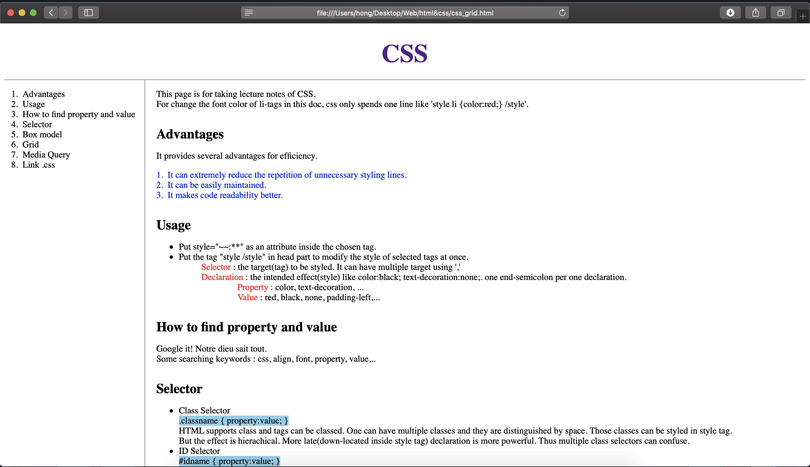
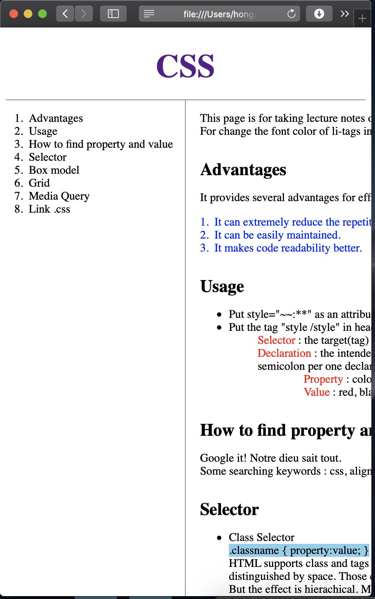
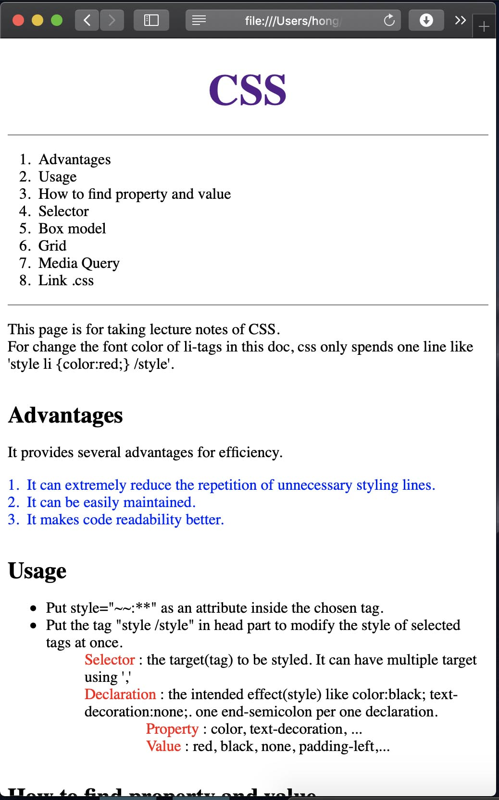

Mar 7, 2020     WEB2 - CSS 10-15 끝!!  
[CSS 내용 정리](https://eunzihong.github.io/html-css/css_grid.html)

----

### 10-11 `css`의 grid  
 
`html`로 내용을 적고 `css`로 디자인을 해나다가 보면 내용이 그저 위에서 아래로만 쭉쭉 쌓이도록 하는 것이 아니라 위쪽엔 제목을 두고 왼쪽에는 목차를 보여주는 칸을, 그 옆의 나머지 칸은 본문 내용이 보이게 하는 식의 얼기설기 블록 디자인을 하고 싶을 수가 있다.  
그렇다면 그 때가 바로 grid를 이용할 때이다. Grid는 배치하고자 하는 각 블록(섹션)을 모두 포함하는 부모 역할의 테두리를 두고 그 테두리에 적용해야한다. 그러므로 일단 태그들을 묶어 부모와 자식으로 나누기 위한 작업이 필요하다.  
<br>
`html`은 이러한 작업을 위한 아무런 내용적 의미가 없는, 그저 태그이기만 한 태그들을 가지고 있다. 원래 `html`의 태그들은 '제목', '순서가 있는 목록', '하이퍼링크', '이미지'등의 태그로 지정된 부분에 내용적 의미를 부여한다. 그런데 지금 부모와 자식의 관계를 지정하는 작업에서 제목으로서의 내용이 아닌 부분에 제목 태그를 써가면서 관계를 설정하는 등의 태그 사용은 내용의 의미를 왜곡할 수 있다. 이럴 때를 위해서 아무런 내용적 의미를 갖지 않는 `html`태그가 두 가지 존재한다.  
```html
<div>block-level no meaning tag</div>
<span>inline no meaning tag</span>
```
> 예전에 봤던 [전세계 태그 사용 순위](https://www.advancedwebranking.com/html/)에서 `html`문서 구조 태그들 (`<html>`, `<head>`, `<body>`, `<title>`, `<meta>`) 다음에 나오던, 실질적으로 가장 많이 활용된다고 볼 수 있는 `<div>`라는 뜬금 없는 태그의 의미를 알게 되었다!  

<br>
자 그러면 이제 이 태그들을 이용해 한 섹션에 넣고자 하는 내용들을 묶을 수 있고, id나 class를 지정해줄 수 있다.  

```html
 <div id="grid">
    <ol id="index">
        <li>Advantages</li>
        <li>Usage</li>
        ...
        <li>Grid</li>
        <li>Media Query</li>
        <li>Link .css</li>
    </ol>
    <div id="article">
        <p>
            This page is for ...
        </p>
        <h2>Advantages</h2>
            ...
```
내 `css`노트 페이지의 코드를 따온 것이다. 노트 목차 부분은 이미 `<ol>`태그로 묶여있으니 그 태그 안에 `id="index`라는 아이디를 부여해주었다. 목차 다음의 내용들은 모두 본문의 내용이고, 그 내용들을 한 번에 묶어 아이디를 주고 싶었다. 바로 여기서! `<div>`태그를 사용하였다.  

```html
<div id="article">
```

index와 article을 두 자식으로 하는 부모태그에도 역시 `<div>`태그로 자식 둘을 포함하게 잡고 아이디를 grid로 주었다.  

```css
#grid{
    display: grid;
    grid-template-columns: 250px 1fr;
}
```
아이디 선택자에 선택된 grid라는 아이디에 대해 display를 "grid"로 설정해주면 이 grid는 이 안에 포함된 자식들을 섹션을 갖는 그리드 틀이 된다. grid-template-columns는 이 자식들을 column형태, 즉 열로 나란히 늘어선 세로 그리드 형태를 갖도록 해준다. value에서는 각 섹션의 영역 폭을 지정해준다. 두 자식에 대해 첫번째 자식은 250px의 폭을 갖고, 두번째 자식은 그 나머지 영역을 갖도록 한다.  

>fr은 `css`의 fractional unit이다. 만약 첫번째 자식이 6fr, 두번째 자식이 1fr을 갖도록 입력하였다면 이 둘은 전체 영역을 7fr이라고 나누었을 때 첫번째 자식이 6fr만큼, 두번째 자식이 1fr을 갖게 된다.

이러한 그리드 레이아웃을 적용함으로써 [기존의 `css`노트 페이지](https://eunzihong.github.io/html-css/css.html)는 [그리드 형태의 새로운 페이지](https://eunzihong.github.io/html-css/css_grid.html)의 모습을 갖게 되었다. 따란-  
<br>

### 12-13 `css`의 media query를 이용한 반응형 웹 디자인  

대부분의 컴퓨터 화면은 가로가 세로보다 긴 납작한 형태인데 반해, 핸드폰은 세로가 더 긴 형태이다. 그렇기 때문에 컴퓨터 화면에서 가로로 길게 보았을 때 보기 편했던 웹 레이아웃이 핸드폰에서는 오히려 불편할 수 있다. 다른 기기 간에 뿐만 아니라 한 기기에서도 핸드폰을 세로로 보느냐 가로로 눕혀서 보느냐에 따라 다시 화면 비율이 달라진다. 이러한 화면 변화에 맞추어 웹이 레이아웃을 다르게 보여주는 것을 **반응형 웹 디자인 Responsive web design**이라 부른다.  
<br>
`css`의 media query는 바로 이러한 반응형 디자인을 가능하도록 지원한다.  
현재까지의 `css`노트 페이지는 이런 형태를 가지고 있다.  



이 웹 브라우저를 가로로 좁게 크기를 줄여보자. 



세로로 긴 화면비율에서는 column grid 레이아웃이 보기가 더 불편하다. 따라서 화면 가로 폭이 일정 이상 줄어들었을 때에는 그냥 block level 레이아웃, 위에서 아래로 이어지는 레이아웃이 되도록 해보자!  

```css
@media(max-width: 800px){
    #grid{
    display:block;
    }
    #index{
        border-right: none;
    }
    #article{
        border-top: 1px solid gray;
        padding:0;
    }
}
</style>
```
여기서 media query가 등장하게 된다. `@media()`의 괄호 안에 제한 조건을 넣어준다. 원하는 것은 화면 폭이 줄어들었을 때는 block 레이아웃을 갖도록 하는 것이다.  
`max-width: 800px`라는 조건은 위에 적용한 코드가 쭉 적용되다가 800px이하의 width를 갖게될 때, 즉 화면폭이 최대 800px일 때(800px을 넘지 않을 때)라는 뜻이다. 그 때에는 grid의 레이아웃을 block이 되도록하고 세부 디자인을 살짝 변경해주었다.  
이제 다시 이 페이지의 폭을 줄여보자.  



세로로 긴 화면에서 내용이 위에서 아래로 나열된 형태를 가지니 훨씬 보기가 편해졌다!  
<br>

### 14 `css`코드를 `html`으로부터 분리해내기

이제까지 `css`코드들은 `html`코드 안에서 `<style> </style>`태그에 둘러싸인 영역이나 `html`의 태그 안에서 속성(attribute)로써 쓰였다. 하지만 그 `css`의 스타일링 내용이 다른 `html`코드들에 동시에 적용될 때에는 각 코드들이 `css`내용을 중복해서 전부 가지고 있는 것은 낭비이다. 공통으로 사용되는 `css`부분을 별도의 `css`코드로 저장하고 그 내용을 원하는 `html`파일에 대해서 코드를 읽어오도록 할 수 있다!  
<br>
`<style> </style>`태그 속 내용을 별도의 "style.css"코드에 저장한다. 대신 그 자리에 다음의 코드만 딱 한 줄 추가해준다.  

```html
<link rel="stylesheet" href="style.css">
```

그러면 `<style> </style>`에 코드 내용을 담고 있을 때와 동일한 효과를 보인다. 또한 이 코드는 다른 `html` 코드에서도 저 link 한 줄로 이용이 가능하기 때문에 굉장히 효율적이다.  
- 여러 `html`코드에서 반복해서 사용되는 코드를 줄일 수 있다.
- 하나의 `css`코드에 대해서만 수정을 하면 여러 `html` 코드에 적용되어 유지 및 보수가 쉽다.
- `html`코드가 `css`의 코드를 덜어낼 수 있어 가독성이 월등히 향상된다.  
- 네트워크에서 페이지를 로드할 때, 동일한 `css`코드에 대해서는 caching이 적용되어 네트워크 효율이 좋다.  
<br>
----
