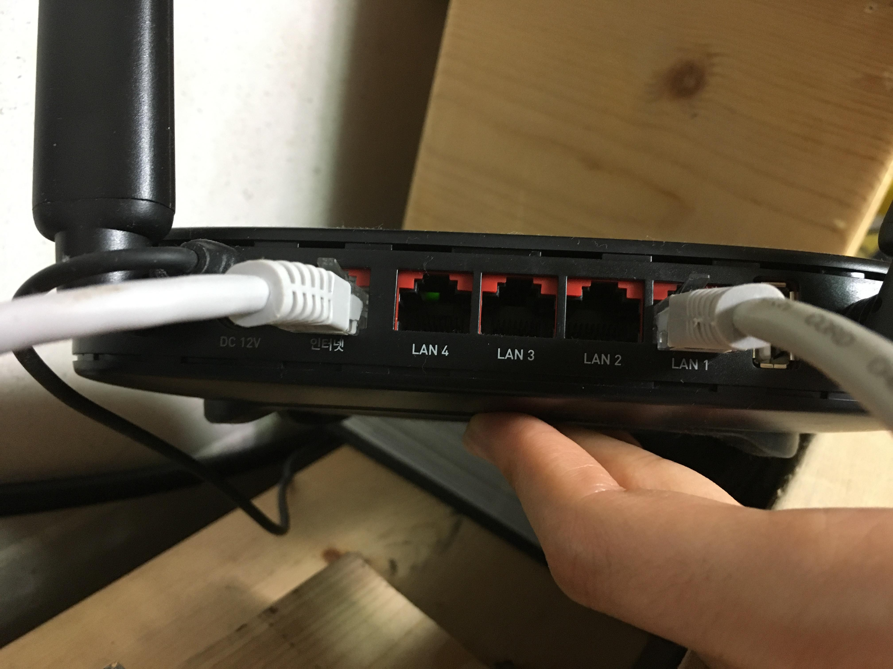
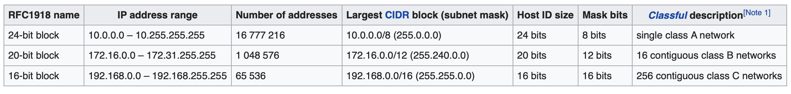
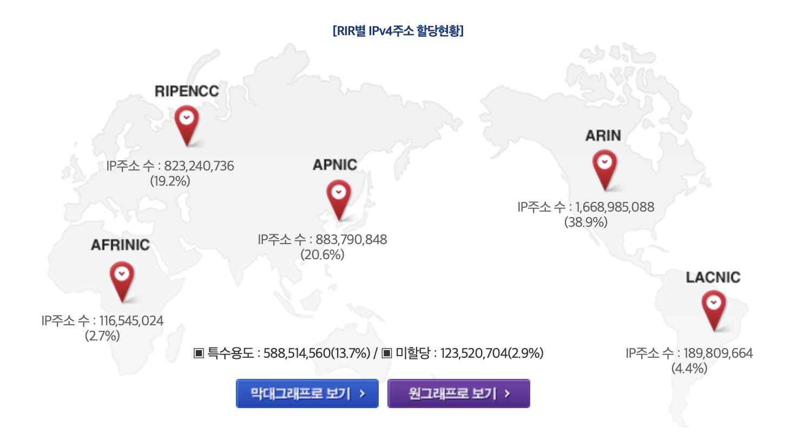
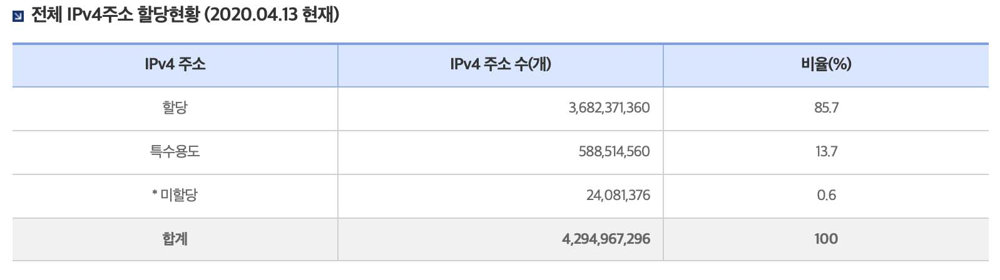

Mar 14, 2020    WEB2 - Home server 1-2  
Mar 15, 2020    WEB2 - Home server 3  
[Home server 내용 정리](https://eunzihong.github.io/html-css/homeserver.html)  

----

개강하고 정신이 하나도 없다!! 스터디 로그는 제때제떄... 로그라도 써야 웹독학의 존재를 까먹지 않을 것 같다..   
 

### 1 IP 주소가 뭐에요? IP system의 개요  
"IP 추적", "IP 주소", ... 뻔하게 듣는 IP라는 단어. 대충 내 컴퓨터라던가 인터넷에 대한 정보라는 것 같은데 정확히 IP가 뭐길래 그렇게들 찾는걸까?  
 
인터넷 이전의 원거리 통신 맛집은 바로 전화! 전화를 생각해보자. 통화를 성사시기키 위해서는 전화망에 연결된, 전화번호를 가진 내 전화와 역시나 전화망에 연결되어있고 전화번호를 가진 상대방 전화가 필요하다. 내가 상대의 전화번호를 띡띡띡 눌러서 통화를 걸면 뚜두 전화 신호가 가고, 상대가 수신을 수락하면 통화가 시작된다. 이러한 일련의 과정과 거의 유사한 과정이 인터넷 연결에서도 일어난다.  
 
"전화망에 연결"이 곧 "인터넷망에 연결(온-라인!)"인 것이고, "전화번호"에 해당하는 것이 바로 "IP주소"인 것이다. 인터넷 망에 연결된 각 기기들(컴퓨터, 노트북, 스마트폰, 게임콘솔, 스마트 스피커 등등)은 각자 고유한 인터넷 연결 번호를 갖게된다. 그래야 상대 기기와 상호작용하면서 인터넷 통신을 진행할 수 있으니까.  
 
**IP**는 Internet Protocol이라는 단어의 약자이다. 인터넷은 알겠고. 프로토콜, 프로토콜은 뭘까?
 프로토콜은 통신 규범, 규약이다. 어떤 기기와 기기 간에 인터넷이 연결되어서 상호 소통을 할 때에 먼저 상대 기기에 연결을 요청하고, 요청을 받아들이면 원하는 연결 활동(저 멀리 프랑스 학교 홈페이지에 접속해서 로그인하고 예전에 수업들었던 내용을 찾아봄 등등)을 진행하게 된다. 이 때에 서로 신호를 주고받는 순서와 형식을 약속해두어서 효율적이고 정확하게 통신이 진행될 수 있게 하는 것이다. 네트워크 뿐만 아니라 컴퓨터에 있어서 다양한 파트에서 프로토콜이 등장한다! 단어에 쫄지 않기.  
 

-- 이하 4월 16일 업데이트 

#### IPv4
우리가 흔히들 IP 주소라고 했을때 떠올리는 168.0.0.4이런 IP주소 형태가 바로 IPv4이다. 초기에 만들어진 IP형식인데 0.0.0.0~255.255.255.255로, 0부터 255사이의 숫자가 .사이로 4번 등장하는 형태이다. 총 4,294,967,296개의 IP주소를 나타낼 수 있다. 그러나 요즘은 너무나 당연해진 스마트폰을 비롯한 스마트 기기들, 사물인터넷, 랩탑, Cloud computing등의 등장으로 인하여 저 4억개의 주소는 금방 모두 소진되어 버렸다! 그래서 새로이 만들어진 주소체계가 바로 IPv6이다.   

#### IPv6
새로이 등장한 IP주소체계로 예컨대 다음과 같은 형태이다.  
 
`2001:0db8:85a3:08d3:1319:8a2e:0370:7334`  
 
이러한 형태로 표현할 수 있는 주소의 개수는 2823,6692,0938,4634,6337,4607,4317,6921,1456이다.  
 

### 2 공유기 Router  

그러나 이미 엄청난 양의 IPv4 주소가 쓰이고 있으므로 IPv4주소 체계를 관리하는 것은 여전히 중요한 문제이다. 한 집안 안에서도 엄마 아빠 딸 아들 스마트폰 한 대 씩에 데스크탑, 랩탑을 쓰는 상황에서 각자 모두 다른 IP주소를 가지는 것은 IP주소 자체의 소진에 있어 감당할 수 없는 수치이다. 따라서 회사나 가정 내에서는 하나의 IP주소를 여러대의 기기가 나누어 사용할 수 있어야 하는데 이러한 역할을 해주는 것이 바로 공유기, router(라우터)이다.  

공유기 뒷면을 보면 WAN(혹은 인터넷. 우리집 라우터는 한글로 '인터넷'이라고 적혀있다.)와 LAN라 적힌 여러 포트들이 있다. 각 요소를 하나씩 살펴보자.  

1. 광역 네트워크 WAN(Wide Area Network)  
라우터에 부여되는, 전 세계 범위의 인터넷 네트워크를 말한다. 집 외부 어디서든 해당 네트워크에 부여된 IP로 접근할 수 있고, 이 IP를 공용IP, public IP address라 한다. 

2. 지역 네트워크 LAN(Local Area Network)  
같은 라우터를 통해 공유되는 지역적인 인터넷 네트워크를 말한다. 라우터 인터넷을 사용하는 해당 지역(집이나 카페, 회사 등등)에서만 접근 가능한 IP 주소가 부여되고 이 주소를 사설IP, private IP address라 한다.  
라우터는 WAN를 받아서 지역의 연결 기기에 LAN를 나누어준다. 라우터 또한 본인 고유의 private IP를 하나 갖게 되는데 이 IP가 바로 게이트웨이 IP(Gateway IP address) 혹은 라우터 IP(Router IP address)라 하는 주소이다. (어우 인턴할 때 사무실에 공유기 설치할 때 고놈의 게이트웨이 주소를 몰라서 아주 애먹었다..)  
IPv4에는 Private IP로만 사용되도록 분류된 주소 범위가 있다.   

  

해당 범위의 주소를 갖고 있다면 그 IP 주소는 분명 공유기에 연결된 지역 네트워크의 IP주소이다. 각 범위별로 IP 주소 개수가 다른데 대개의 경우는 6만개 이상의 기기에 연결될 일이 없으므로 우리가 일상에서 흔히 사용하는 라우터의 사설 IP는 192.168.~.~하는 식이다. 어쩐지 게이트웨이 IP가 항상 192 어쩌구더라니.  
 

------

++ 그런데 IPv4주소가 모두 소진되었다기엔 우리 주변에서 범용 IP주소가 넘나 팡팡파라바라팡팡팡 쓰이고 있지 않은가? 해서 직접 찾아보았다! (그냥 재미로...)  

  

[한국인터넷정보센터](https://한국인터넷정보센터.한국/jsp/infoboard/stats/landCurrent.jsp) 사이트를 방문하면 다양한 IPv4 할당 현황을 확인할 수 있다. 전 세계 IPv4 주소는 IANA(Internet Assigned Numbers Authority)에 의하여 관리되고 각 대륙별로는 RIR(Regional Internet Registry)에 의해 IPv4 주소들이 할당 및 관리된다. 위 이미지에 나온 포인트와 이름들이 각 대륙별 IPv4관리 기점 RIR 이름과 할당 개수(비율)이다. 초기 인터넷 발달이 북미 대륙에서 이루어져서인지 유럽과 아시아가 20%대의 할당량을 받는 반면에 북미에서만 40%의 IPv4 주소가 할당되어 이용되는 것을 볼 수 있다.  

  

위의 표를 보면 85.7%의 주소가 각 대륙과 나라에 할당되었고 특수용도로 13.7%가 사용되어 99.4%의 주소들이 이미 할당, 사용되고 있는 것을 볼 수 있다.  
 

   

[위키피디아 IPv4 문서](https://ko.wikipedia.org/wiki/IPv4)를 보면 위와 같은 문구가 나온다. 이미 9년전에 IPv4 주소는 모두 소진되었다. 디지털타임스의 2008년 [디지털포럼](http://www.dt.co.kr/contents.html?article_no=2008082002012269686001) 기사에서는 2012~2014년까지는 유지될 것으로 보이던 IPv4주소가 빠르면 3년 안에 소진될 것 같다고 하는 내용이 나오는데 정확히 들어맞았다..(내가 살고 있는 시대에 이런 일이 생겨나다니 너무 신기하고 좋다!!)  
현재 [우리나라에는 할당 사항](https://한국인터넷정보센터.한국/jsp/infoboard/stats/counIpv6Add.jsp)이 확인되지는 않지만 IPv6가 이미 미국과 중국과 여러 유럽 나라들에 할당된 것으로 보아 머지않아 현재의 IPv4처럼 일상에서 IPv6주소를 사용하게 될 것이다! (그러면 IP주소를 외우고 다니는 것은 못하게 되겠지.. 과제 서버 IP는 외우고 다니곤 하는데...)

-------

다시 본문으로 돌아와서...  
 

### 3 Network Address Translation(NAT)   

이제 라우터가 어떤 일을 하는지 대략적으로 알아보기로 하자.   
 
내가 현재 접속 중인 카페의 public IP주소는 122.202.194.194이고 라우터의 게이트IP는 10.128.128.128, 내 랩탑에 부여된 private IP는 10.116.56.89이다. 만약 내가 google.com, IP 216.58.193.78(각 도메인의 IP는 traceroute로 쉽게 확인할 수 있다. 나중 포스트에 올리겠다!)의 서버에 접속하려 한다고 해보자.  

task : LAN의 `10.116.56.89`에서 외부의 `216.58.193.78`로 request  
client : `10.116.56.89` under the router`10.128.128.128`  
server : `216.58.193.78`  
 

1. 내 랩탑에서 구글 서버에 접속한다는 요청(request) 발생
2. 라우터(공유기) `10.128.128.128`에 요청이 전달되고 라우터 내부에 로컬IP`10.116.56.89`에서 이러한 요청을 했음이 저장됨
3. NAT(Network Address Translation)과정을 통해 내 요청이 로컬IP 값이 아닌 라우터에 연결된 공용IP `216.58.193.78`의 값을 가진 요청으로 변환됨
4. 해당 서버의 IP `216.58.193.78` 로 요청 전달
5. 서버에서 요청사항을 처리하여 다시 여기 카페의 라우터`10.128.128.128`로 응답(response)전달
6. 라우터에서 이전에(2.) 저장해둔 로컬IP와 요청내역에 따라 내 로컬IP로 해당 응답 전달

위의 과정에 따라 라우터가 로컬호스트의 요청을 외부서버에 전달하여 처리한다.  
위는 대략적인 설명으로 실제로는 훨씬 복잡하고 많은 단계와 프로토콜을 거쳐 이루어진다. 더 자세한 내용은 생활코딩 웹독학 포스트들말고 이번학기 듣고 있는 네트워크강의 내용 포스트에 올려보도록 하겠다..    
 
 