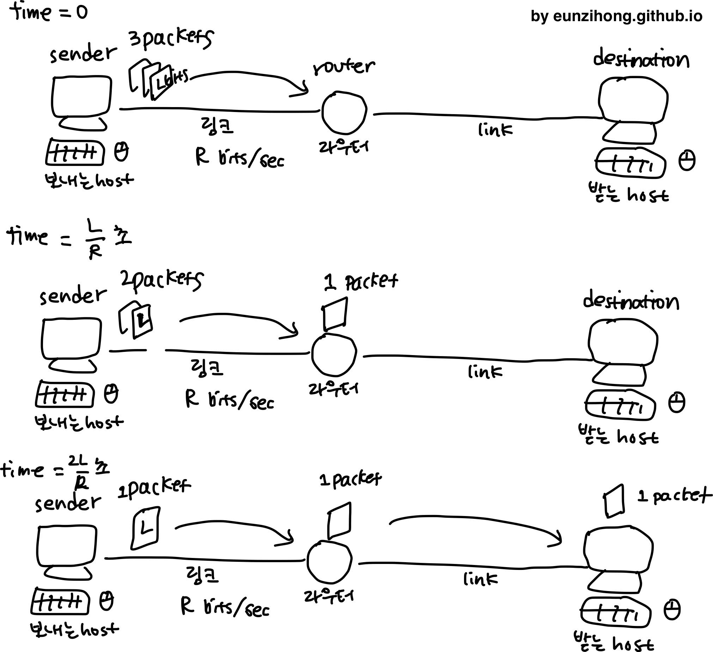
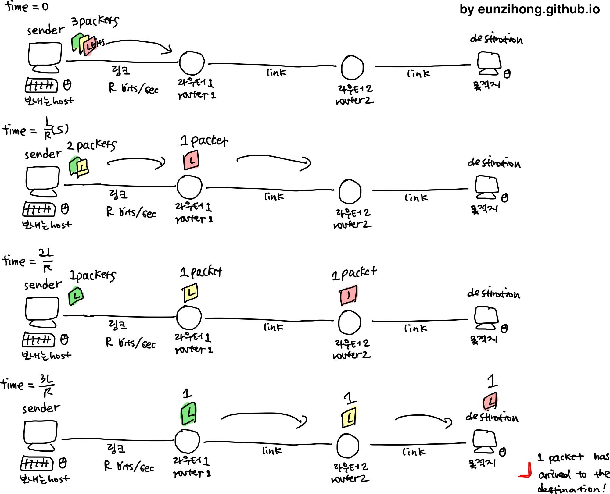

Computer Networking: A top-down approach  
[Chapter 1] Computer Networks and the Internet  
1.2 Network Core  

----  

### 1.3.1 패킷 교환 Packet Switching  
각 엔드 시스템간의 데이터는 규격화된 작은 데이터 패키지로 나뉘어 전달이 되고, 이 패키지를 **패킷(Packet)** 이라 한다. 패킷은 **링크**와 **패킷 스위치 노드**를 통해 전달된다. 링크 상에서는 링크의 최대 전송 속도로 전송된다. L bits의 패킷을 R bps의 링크에서 전송한다면 L/R초의 시간이 소요된다.  

#### 저장 후 전달 Store-and-Forward Transmission  
각 패킷이 작은 데이터 패키지라고는 하지만 한 패킷 안에서 먼저 도착하는 앞부분 비트가 있고 아직 전송 중인 남은 비트들이 있다. 라우터는 이 비트가 들어옴과 동시에 바로 다음 라우터로 보내는 것이 아니고 한 패킷의 비트들이 모두 들어올 때까지 기다렸다가 패킷이 완전이 다 들어오면 그 때 포워딩(전송, forwarding)을 한다.  

  

1. 첫 패킷이 도착할 때까지는 L/R초의 시간을 온전히 기다린다.
2. 먼저 도착한 첫 패킷은 다음 목적지(호스트 또는 다른 라우터)에 보낸다.
3. 첫 패킷이 전송되는 동안 계속해서 나머지 패킷이 해당 라우터로 들어온다.
4. 마지막 패킷까지 모두 전송을 하고 전송을 마무리한다.  

따라서 P개의 패킷이 한 개의 노드 라우터를 거쳐서 포워딩이 될 때는 (P+1)L/R초의 시간이 소요된다.  

만약 최종 목적지까지 N개의 링크, 즉 N-1개의 라우터를 거친다면 얼마의 시간이 걸릴까?  

  

1. 첫 패킷이 N개의 링크를 이동하는 시간은 NL/R초가 소요된다. (빨간 패킷)
2. 첫 패킷 이후 P-1개의 패킷이 남아있고 이 패킷들이 각각 L/R초당 하나씩 마지막 링크를 통과한다. (P-1)L/R초  
3. 총 소요시간은 NL/R + (P-1)L/R = (N + P-1)L/R초  

따라서 N개의 링크를 통해 P개의 패킷이 포워딩 될 때는 (N+P-1)L/R초의 시간이 소요된다.  

(하 뿌듯하다)  

#### 큐잉 지연과 패킷 손실 Queuing Delays and Packet Loss  
